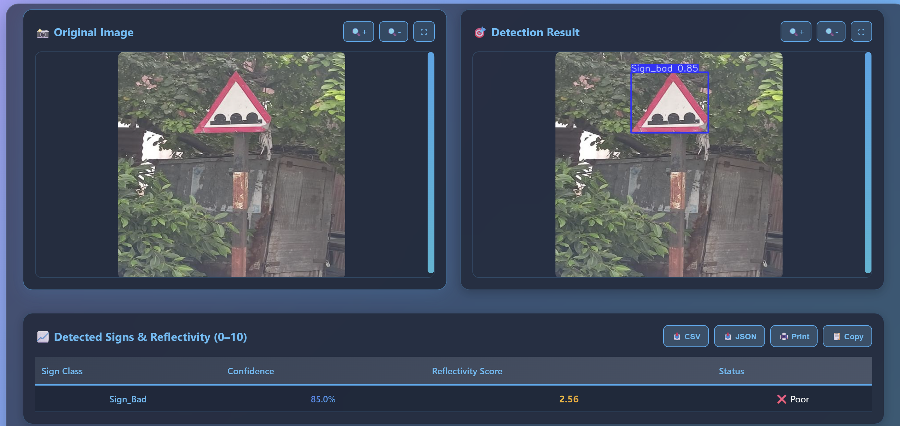
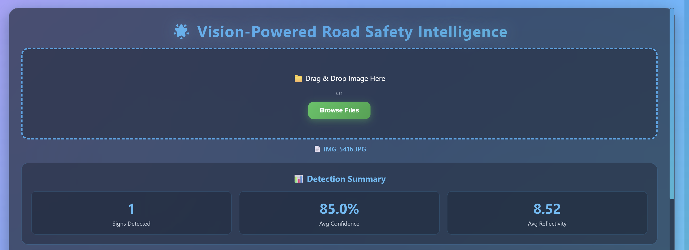
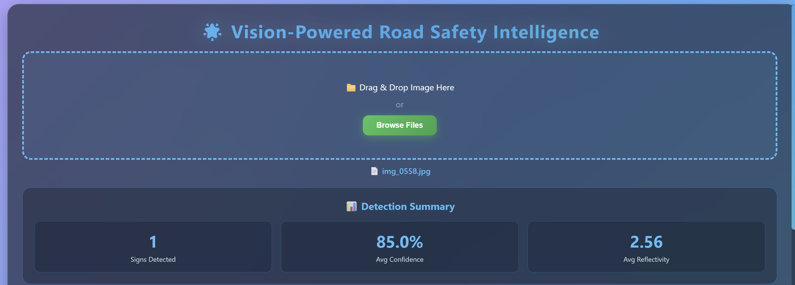

# 🚦 Road Sign Reflectivity Detection Using YOLOv8

## 📌 Project Overview

**Road Sign Reflectivity Detection** is an AI-based computer vision system designed to identify the visual condition of road signs and classify them into three categories:

* 🟢 **Good** — Road sign has good visibility/reflectivity
* 🟡 **Moderate** — Road sign has reduced visibility/reflectivity
* 🔴 **Bad** — Road sign has poor visibility/reflectivity

The system uses **YOLOv8** for object detection and classification, with **SAM (Segment Anything Model)** used to assist with annotation of additional images.

The objective is to help road authorities identify potentially degraded road signs and prioritize signs that may require maintenance or replacement.

---

## 🎯 Business Problem

Road signs are an important part of road safety. Over time, their visibility can decrease due to:

* Weather conditions
* UV exposure
* Dust and dirt
* Aging materials
* Physical damage
* Poor lighting conditions

Currently, identifying degraded road signs can require manual inspection.

This project explores an AI-based approach that can automatically analyze road-sign images and identify their condition.

### Proposed Solution

The system analyzes road-sign images using computer vision and assigns a reflectivity/condition category:

Road Sign Image
       │
       ▼
Image Processing
       │
       ▼
YOLOv8 Detection
       │
       ▼
Condition Classification
       │
 ┌─────┼─────────┐
 ▼     ▼         ▼
Good  Moderate   Bad


## 🏗️ System Architecture

```text
┌───────────────────────────────┐
│ Business & Data Understanding │
└───────────────┬───────────────┘
                │
                ▼
       ┌─────────────────┐
       │ Data Collection │
       └────────┬────────┘
                │
                ▼
       ┌─────────────────┐
       │ Data Storage    │
       │    Database     │
       └────────┬────────┘
                │
                ▼
       ┌────────────────────────┐
       │ Manual Annotation      │
       │ Good / Moderate / Bad  │
       └───────────┬────────────┘
                   │
                   ▼
          ┌────────────────┐
          │ Train-Test     │
          │ Split          │
          └───────┬────────┘
                  │
                  ▼
          ┌────────────────┐
          │ YOLOv8 Training │
          └───────┬────────┘
                  │
                  ▼
          ┌────────────────┐
          │ Initial Model  │
          │ (.pt weights)  │
          └───────┬────────┘
                  │
                  ▼
          ┌────────────────┐
          │ SAM Assisted   │
          │ Annotation     │
          └───────┬────────┘
                  │
                  ▼
          ┌────────────────┐
          │ Data           │
          │ Augmentation   │
          └───────┬────────┘
                  │
                  ▼
          ┌────────────────┐
          │ Final YOLOv8   │
          │ Model          │
          └───────┬────────┘
                  │
                  ▼
          ┌────────────────┐
          │ Evaluation     │
          └───────┬────────┘
                  │
                  ▼
          ┌────────────────┐
          │ Flask API      │
          └───────┬────────┘
                  │
          ┌───────┴────────┐
          ▼                ▼
     Monitoring         Users
 Prometheus + Grafana
```

---

## 🧠 Technologies Used

| Technology   | Purpose                       |
| ------------ | ----------------------------- |
| Python       | Programming language          |
| YOLOv8       | Object detection              |
| SAM          | Assisted image annotation     |
| OpenCV       | Image processing              |
| Roboflow     | Dataset annotation/management |
| Flask        | REST API                      |
| HTML/CSS     | Web interface                 |
| Prometheus   | API/system monitoring         |
| Grafana      | Monitoring dashboard          |
| Pandas       | Data processing               |
| NumPy        | Numerical operations          |
| Matplotlib   | Visualization                 |
| Google Colab | Model training                |
| Git/GitHub   | Version control               |

---

## 📊 Dataset

The project uses Indian road-sign images collected for the purpose of analyzing road-sign visibility and condition.

The images are categorized into three classes:


Good
Moderate
Bad


The dataset contains road-sign images captured under different lighting conditions, including:

* Morning
* Evening
* Night

### Dataset Source

The Indian Traffic Sign Image Dataset used as a source/reference can be found here:

https://github.com/datacluster-labs/Indian-Traffic-Sign-Image-Dataset

> Dataset files are not included directly in this repository because of their size. Please refer to the dataset source and project instructions for obtaining the data.

---

## 🏷️ Annotation Process

Initially, a subset of images was manually annotated into:

```text
Sign_Good
Sign_Moderate
Sign_Bad
```

The manually annotated images were used to train an initial YOLOv8 model.

The initial model was then used together with **SAM-assisted annotation** to help label additional images.

This reduced the amount of manual annotation required for the remaining dataset.

---

## 🔄 Data Preparation

The data preparation pipeline includes:

1. Image collection
2. Image quality checking
3. Manual annotation
4. Dataset organization
5. Train-test split
6. YOLO format conversion
7. Initial model training
8. SAM-assisted annotation
9. Minority-class augmentation
10. Final model training
11. Model evaluation

---

## ⚖️ Class Balancing

During dataset analysis, the **Bad** and **Moderate** classes contained fewer samples than the **Good** class.

This caused the initial model to tend toward the Good class.

To address this issue, augmentation was applied to the minority classes.

The objective was to provide the model with more representative examples of:

```text
Bad
Moderate
```

and improve detection across all three classes.

---

## 🤖 YOLOv8 Model

The project uses **YOLOv8** for object detection.

The model is trained to detect road signs and classify their condition.

### Training Configuration

Example configuration used during training:

```text
Model: YOLOv8
Image Size: 768 × 768
Epochs: 100
Patience: 20
GPU: NVIDIA Tesla T4
Framework: Ultralytics
```

The model training was performed using **Google Colab**.

---

## 📈 Model Evaluation

The trained model is evaluated using standard object-detection metrics, including:

* Precision
* Recall
* mAP
* Confusion Matrix
* Class-wise performance

The evaluation helps determine how effectively the model identifies:

```text
Good signs
Moderate signs
Bad signs
```

---

## 🔢 Reflectivity / Condition Score

In addition to the predicted class, the application can provide a simplified **0–10 condition score**.

The score is primarily based on the predicted class and model confidence.

Conceptually:

```text
Good      → Higher Score
Moderate  → Medium Score
Bad       → Lower Score
```

Additional image characteristics such as:

* Brightness
* Sharpness
* Lighting condition
* Color information
* Night/day condition

can also be considered as supporting validation features.

> The score is an application-level interpretation and should not be treated as a calibrated physical measurement of retroreflectivity.

---

## 🌐 Flask API

A Flask-based API is used to provide model predictions to the application.

### Basic Workflow

```text
User Uploads Image
        │
        ▼
     Flask API
        │
        ▼
   YOLOv8 Model
        │
        ▼
 Prediction
        │
        ▼
Condition + Score
        │
        ▼
 User Interface
```

The API provides a simple interface for sending an image to the trained model and receiving prediction results.

---

## 📊 Monitoring

The application architecture includes:

### Prometheus

Used for collecting application/API metrics.

### Grafana

Used to visualize monitoring metrics through dashboards.

Example monitoring information can include:

* API requests
* Response time
* Request count
* Application performance
* Prediction-related metrics

---

## 📁 Project Structure

```text
traffic_sign_reflectivity/
│
├── api/
│   ├── app.py
│   └── ...
│
├── models/
│   └── ...
│
├── src/
│   ├── ...
│   └── ...
│
├── data/
│   └── ...
│
├── runs/
│   └── ...
│
├── prepare_dataset.py
│
├── requirements.txt
│
├── README.md
│
└── .gitignore
```

> Dataset files, virtual environments, training outputs, and large model weights may be excluded from GitHub using `.gitignore`.

---

## ⚙️ Installation

### 1. Clone the repository

```bash
git clone https://github.com/dipaksawalkar/Road_Sign_Reflectivity_Detection-.git
```

### 2. Move into the project directory

```bash
cd Road_Sign_Reflectivity_Detection-
```

### 3. Create a virtual environment

Windows:

```bash
python -m venv venv
```

Activate it:

```bash
venv\Scripts\activate
```

### 4. Install dependencies

```bash
pip install -r requirements.txt
```

---

## ▶️ Running the Project

After installing the dependencies, run the Flask application:

```bash
python api/app.py
```

The API/web application can then be accessed through the local address displayed by Flask.

> The exact command may vary depending on the final Flask application entry point.

---

## 🧪 Example Predictions

The trained YOLOv8 model detects road signs and classifies their condition based on their visual characteristics.

### 🟢 Good Sign Detection

<p align="center">
  
</p>

The model successfully detects a road sign classified as **Good**.

---

### 🔴 Bad Sign Detection

<p align="center">
  
</p>

The model detects a road sign classified as **Bad**.

---

## 📊 Condition Score

The application also provides a simplified **0–10 condition score** based primarily on the predicted class and model confidence.

### 🟢 Good Sign — Score

<p align="center">
  
</p>

### 🔴 Bad Sign — Score

<p align="center">
  
</p>

The actual output depends on the trained model prediction and image characteristics.

---

## 🚀 Future Improvements

Possible improvements include:

* Larger and more diverse datasets
* More night-time images
* Better representation of weather conditions
* Improved minority-class balancing
* Model hyperparameter optimization
* Calibration of the 0–10 condition score against actual reflectivity measurements
* Real-time video detection
* Mobile application integration
* Cloud deployment
* Automated maintenance alerts
* GPS-based road-sign location tracking
* Integration with municipal road-maintenance systems

---

## 💡 Project Impact

The proposed system can help road-maintenance teams identify potentially degraded road signs from images and use the predictions as an additional input when prioritizing inspections.

The system is intended as a **decision-support tool**, with physical inspection and appropriate reflectivity measurements remaining important for maintenance decisions.

---

## 👨‍💻 Author

### Dipak Sawalkar

**Computer Science | Data Science | Machine Learning**

GitHub:
https://github.com/dipaksawalkar

Project Repository:
https://github.com/dipaksawalkar/Road_Sign_Reflectivity_Detection-

---

## ⭐ Acknowledgements

* Ultralytics YOLO
* Meta AI — Segment Anything Model (SAM)
* Roboflow
* OpenCV
* Python
* Google Colab
* Indian Traffic Sign Image Dataset

---

## 📜 License

This project is intended for educational, research, and portfolio purposes.

Please check the licenses and usage terms of the underlying datasets and third-party models before commercial use.
